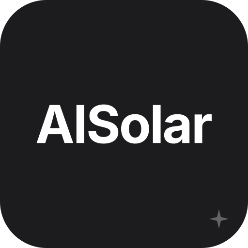

<p align="center">
  
</p>

<h1 align="center">AISolar</h1>

<p align="center"><em>The operating system for Irish solar installers.</em></p>

---

AISolar reads the day/night usage split from a customer's electricity bill and drives the whole installer workflow from there: **bill → estimate → site survey → proposal → SEAI grant → install → customer portal.** A queue of autonomous agents handles the busywork — scheduling, drafting, follow-ups — while proposals are always **drafted, never auto-sent**. Your crews install; the platform runs the rest.

Multi-tenant by design: each installer is a tenant with their own branding, data, and pipeline, isolated at the database with row-level security.

## Stack

| Layer | Tech |
|---|---|
| **Frontend** | Vite · React 18 · TypeScript · Tailwind · shadcn/ui (Radix) · framer-motion |
| **Backend** | Supabase — Postgres · Auth · Edge Functions · Realtime · Storage (RLS-enforced, multi-tenant) |
| **AI** | Pluggable LLM layer (bring-your-own key) for bill extraction, proposal drafting, and the customer/coach "brain" — with a **deterministic floor so every feature works without AI** |
| **Payments** | Stripe (card) · Coinbase Commerce (crypto) |
| **Email** | Postmark (transactional — magic links, notifications, receipts) with bounce/complaint suppression + `List-Unsubscribe` |
| **Maps** | Google Maps + Solar API (satellite / property context — no auto roof-detection; proposals use the bill + survey) |
| **Deploy** | Vercel (static) · Supabase (serverless edge functions) |

## Quick start

```bash
npm install
npm run dev        # local dev server
npm run build      # production build
npm run preview    # serve the build
```

Demo data is a deliberate **toggle in the owner sidebar** (sample leads across every NC6/NC7 variant) — it never touches real data, and there's a guided tour behind it.

## Environment

Client vars are prefixed `VITE_` (safe to expose); server secrets are set with `supabase secrets set` and never appear in the bundle. See [`.env.example`](.env.example) for the full manifest and [`docs/SECRETS.md`](docs/SECRETS.md) for the rotation runbook.

```bash
VITE_SUPABASE_URL=https://your-project.supabase.co
VITE_SUPABASE_PUBLISHABLE_KEY=your-anon-key
# server-side (supabase secrets set …): POSTMARK_SERVER_TOKEN, STRIPE_SECRET_KEY,
# STRIPE_WEBHOOK_SECRET, POSTMARK_WEBHOOK_SECRET, SUPABASE_SERVICE_ROLE_KEY …
```

## The surfaces

| Surface | Route | Who |
|---|---|---|
| **Owner cockpit** | `/owner` | the installer's command centre — pipeline, calendar, clients, products, agents, analytics, settings |
| **Consultant** | `/consultant` | inbox-first — leads, the estimate → proposal flow, AI coach |
| **Installer (field)** | `/installer` | today · schedule · routing · inbox → the job view with the commissioning checklist + serial attestation |
| **Customer portal** | `/customer/:token` | passwordless magic link — project status, chat with the brain, pay, download the compliance pack |
| **Signup** | `/signup` | self-serve tenant provisioning (card-payer becomes their tenant's admin) |
| **Embed widget** | `/embed` | a tenant-branded solar calculator for installer websites → captures leads |

## Autonomous agents

A job queue drained every minute by the `agent-drain` edge function; database triggers enqueue work on stage changes. **Proposals are draft-only — never auto-sent.** The agents cover lead intake + scoring, survey scheduling, proposal drafting, **SEAI grant tracking** (it *tracks* the application — it does not submit on the customer's behalf), install coordination, post-install warranty + review requests, stage-appropriate follow-ups, payment reminders, and stale-lead escalation.

## Security & compliance

- **Row-level security on every tenant table** — cross-tenant isolation proven live (reads and writes).
- Edge functions are authenticated; the service-role key lives in Supabase, never in the client bundle.
- Vercel security headers (HSTS, CSP, X-Frame-Options, nosniff, referrer-policy, permissions-policy).
- **GDPR**: cookie consent, data-subject-rights panel, `anonymise_lead()` for erasure, sub-processor disclosure, PII-safe edge-function logging.
- Email reputation: hard-bounce / spam-complaint suppression, so a cold or dead address never drags down deliverability.
- Compliance paper-trail (SEAI grant, ESB NC6/NC7, RECI sign-off) is pre-populated from the survey + install data and surfaced to the customer.

## Documentation

- [`docs/LAST_MILE.md`](docs/LAST_MILE.md) — **start here.** The single source of truth: current state, every decision and its why, the security evidence, and the founder operating playbook.
- [`docs/DEPLOYMENT_GATE.md`](docs/DEPLOYMENT_GATE.md) — the go-live runbook (env vars, edge functions, secrets, DNS, smoke test).
- [`docs/COMMS_AI_SYSTEM.md`](docs/COMMS_AI_SYSTEM.md) — how the brains + comms work (three brains, every trigger, the guardrails).
- [`docs/SECRETS.md`](docs/SECRETS.md) — secrets inventory + rotation.

## Brand

AISolar is a product of **Renewably**. Customer-facing surfaces carry each installer's own branding.

## License

Proprietary. © Renewably 2026. All rights reserved.
