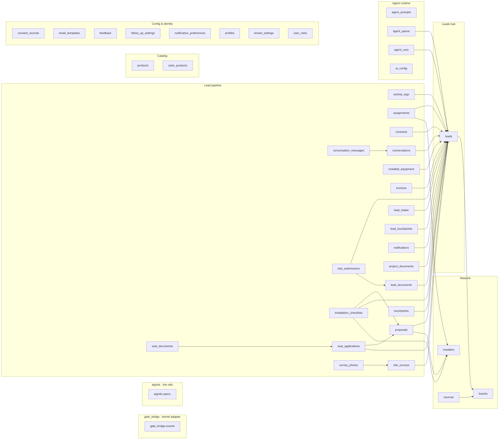

# AISolar-V5 — Schema Map
### 40 tables · 40 FK relationships, grouped by layer. The logical view Supabase Studio's auto-layout won't give you.

**How to read it:** `gate_bridge` (kernel adapter) and `aigrids` (rails) sit apart from the app — they speak to the
kernel, they aren't the app. The **network** (brand→source) feeds the **leads hub**; every **pipeline** table hangs off
`leads` (child→parent arrows). **Catalog** + **config** are reference islands with no FKs — correct, and exactly what
was piling up as unconnected "roots" in Studio's tree. Arrows = foreign keys. Generated live from `ywizcsulurxoqjdgnkvc`.
